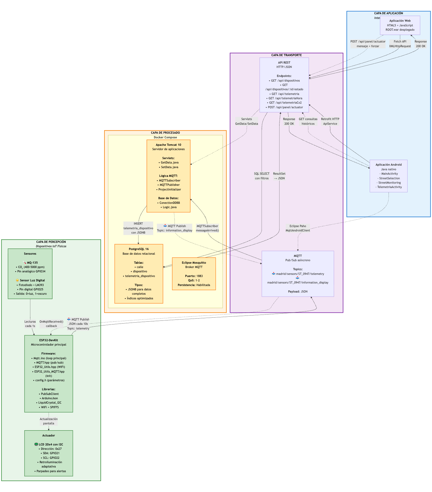

# Sistema IoT de Monitorización Urbana con ESP32

Proyecto académico desarrollado para la asignatura de Computación Ubicua.

Implementa un sistema IoT completo para monitorizar y controlar un panel informativo urbano mediante **ESP32**, **MQTT**, **backend Java**, **PostgreSQL**, **Docker**, **aplicación web** y **aplicación Android**.

---

## Objetivo del proyecto

El sistema permite:

- Captar datos ambientales: luminosidad y CO₂.
- Enviar telemetría desde una ESP32 mediante MQTT.
- Almacenar los datos recibidos en PostgreSQL.
- Consultar el estado actual y el histórico desde una aplicación web y una app Android.
- Enviar mensajes al panel LCD desde la aplicación web.

---

## Arquitectura general

El proyecto se divide en cuatro capas:

1. **Capa de percepción**: ESP32, sensor de luz, sensor MQ-135 y pantalla LCD.
2. **Capa de transporte**: comunicación MQTT mediante Mosquitto.
3. **Capa de procesado**: backend Java desplegado en Tomcat y base de datos PostgreSQL.
4. **Capa de aplicación**: interfaz web y aplicación Android.



---

## Tecnologías utilizadas

- ESP32 / Arduino
- MQTT
- Mosquitto
- Java
- Apache Tomcat
- PostgreSQL
- Docker / Docker Compose
- Android Studio
- Retrofit
- Eclipse Paho MQTT
- HTML / CSS / JavaScript

---

## Estructura del repositorio

```text
Sistema-IoT-monitorizacion/
├── androidApp/      # Aplicación móvil Android
├── backend/         # Backend Java, servlets, MQTT y acceso a base de datos
├── docker/          # Infraestructura Docker: Tomcat, PostgreSQL y Mosquitto
├── docs/            # Memoria, diagramas y documentación
├── esp32/           # Código del dispositivo físico
└── README.md
```

---

## Módulos del proyecto

| Carpeta | Descripción |
|---|---|
| [`androidApp/`](androidApp/) | Aplicación móvil Android para monitorización y consulta de históricos |
| [`backend/`](backend/) | Backend Java con servlets, comunicación MQTT, API REST y acceso a PostgreSQL |
| [`docker/`](docker/) | Infraestructura Docker con Mosquitto, PostgreSQL y Tomcat |
| [`docs/`](docs/) | Memoria, diagramas y documentación del proyecto |
| [`esp32/`](esp32/) | Código del dispositivo físico basado en ESP32 |

---

## Funcionamiento general

El flujo principal del sistema es el siguiente:

1. La ESP32 recoge datos de luminosidad y CO₂.
2. El dispositivo construye un mensaje JSON con la telemetría.
3. La telemetría se publica en un topic MQTT.
4. El backend Java, desplegado en Tomcat, recibe el mensaje mediante un suscriptor MQTT.
5. Los datos se almacenan en PostgreSQL.
6. La aplicación web y la aplicación Android consultan la información mediante la API REST.
7. Desde la aplicación web se pueden enviar mensajes al panel LCD mediante MQTT.

---

## Comunicación MQTT

El sistema utiliza MQTT para comunicar el dispositivo físico con el backend.

### Topic de telemetría

```text
madrid/sensors/ST_0947/telemetry
```

La ESP32 publica periódicamente en este topic los datos captados por los sensores.

### Topic de control

```text
madrid/sensors/ST_0947/information_display
```

La ESP32 se suscribe a este topic para recibir mensajes enviados desde el backend y mostrarlos en la pantalla LCD.

---

## Ejemplo de mensaje de telemetría

```json
{
  "sensor_id": "ST_0947",
  "street_id": "ST_0947",
  "timestamp": "2025-12-01T10:30:00",
  "brightness_level": "ALTA",
  "co2_ppm": 420,
  "air_quality_message": "Buena",
  "current_message": "Información urbana"
}
```

---

## Instalación rápida

### Requisitos previos

- Docker
- Docker Compose
- Java / Maven, si se desea compilar el backend manualmente
- Android Studio, si se desea ejecutar la aplicación móvil
- Arduino IDE o PlatformIO, si se desea cargar el código en la ESP32

### Despliegue con Docker

Desde la carpeta `docker/`:

```bash
cd docker
docker compose up --build
```

Este comando levanta los servicios principales del sistema:

- Broker MQTT Mosquitto
- Base de datos PostgreSQL
- Servidor Tomcat con el backend Java

---

## Aplicaciones cliente

### Aplicación web

Permite:

- Consultar los dispositivos registrados.
- Visualizar el estado actual del panel.
- Consultar el histórico de telemetría.
- Enviar mensajes al panel LCD.

### Aplicación Android

Permite:

- Seleccionar calle y dispositivo.
- Visualizar la telemetría en tiempo real.
- Consultar históricos por fecha.
- Consultar históricos por fecha y rango horario.
- Adaptar la interfaz en función del nivel de luminosidad recibido.

---

## Documentación

La documentación completa del proyecto se encuentra en la carpeta [`docs/`](docs/).

Incluye:

- Memoria justificativa.
- Diagrama de arquitectura.
- Diagrama de clases de la aplicación Android.
- Documentación de instalación y uso.
- Explicación funcional y técnica del sistema.

---

## Estado del proyecto

Este proyecto es un **prototipo académico funcional** desarrollado para la asignatura de Computación Ubicua.

No está diseñado para producción real. Quedan fuera del alcance:

- Autenticación de usuarios.
- Cifrado TLS en MQTT.
- Gestión avanzada de permisos.
- Despliegue en infraestructura municipal real.
- Monitorización de múltiples dispositivos reales en producción.

---

## Competencias demostradas

Este proyecto demuestra conocimientos en:

- Arquitectura IoT por capas.
- Programación de microcontroladores ESP32.
- Comunicación MQTT.
- Desarrollo backend en Java.
- Diseño de APIs REST.
- Persistencia en PostgreSQL.
- Despliegue con Docker Compose.
- Desarrollo de aplicación Android.
- Desarrollo de aplicación web.
- Integración extremo a extremo entre hardware y software.

---

## Autores

- Diana Torrico López
- David Cubas Martí
